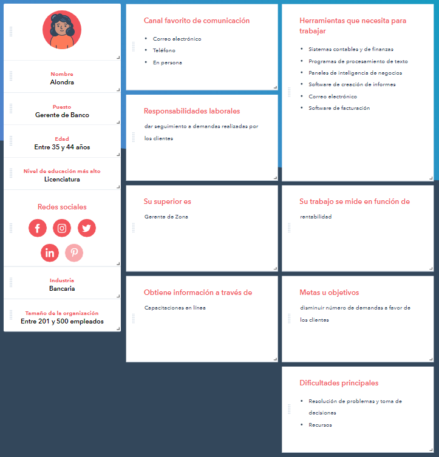
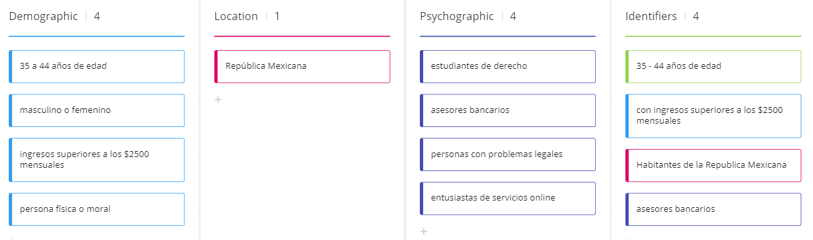
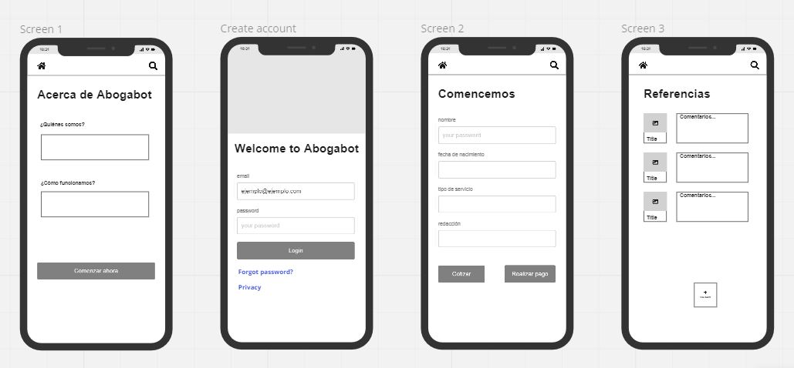
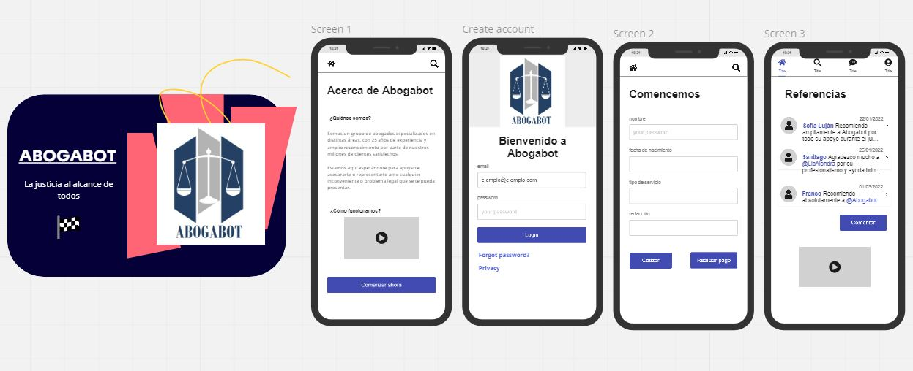

# Prácticas de Intro a Frontend

Para las prácticas de esta semana tendrán el siguiente caso y a raíz y sacar los puntos mencionados abajo.

**Caso: Abogabot**
Descripción:

- Es un despacho de abogados que quiere automatizar las demandas de sus clientes, esto lo harán a traves de una página web llenando un formulario.
- Al momento de llenar el formulario se manda al proceso de pago para finalizar la transacción.
- Para dar seguimiento a su demanda, el cliente crea una cuenta en la plataforma y verá el seguimiento de cada una de las actualizaciones del proceso legal.
- El administrador del sitio recbe la notificación de una nueva demanda y con los datos llenados del formulario se crea automaticamente el documento  legal en formato word para empezar el proceso.
- El administrador recibe el pago y debe de ser capaz de verlo en un dashboard para ver la cantidad de ingresos recibidos.
- El administrador actualiza el proceso de la demanda y agrega comentarios en cada paso del proceso.
- Al usuario le llegan correos de notificación para saber el avance de su proceso.
- La página debe de ser responsive para poderla ver desde el celular.
- La preferncia de colores del cliente es azul marino y blanco, pero acepta propuestas.

  **Prácticas:**

  * Toma de requerimientos
  * Crea buyer person
  * Crea tu primer Wireframe UX
  * Ahora el UI

#### Toma de requerimientos

---

Creación de sitio web que permita:

Al cliente:

* Registrarse
* Iniciar sesión
* Cotizar el precio de demanda
* Realizar pago de demanda
* Iniciar proceso de demanda
* Recibir notificaciones vía correo electrónico cada se realice una actualización a su demanda.
* Publicar comentarios en en área de referencias

Al administrador:

* Crear cuenta
* Iniciar sesión
* Ver las demandas
* Actualizar las demandas
* Consultar las demandas
* Eliminar las demandas
* Recibir notificaciones cuando se reciba un pago de demanda
* Consultar dasboard sobre los ingresos respecto a los pagos de demandas recibidos
* Ver comentarios en el área de referencias
* Eliminar comentarios en en área de refencias

Para más detalle puede consultar el documento [Requerimientos](./1.-Requerimientos.doc)

#### Buyer person

---

Para la creacíon del Buyer person se hizo uso de la herramienta de Hubspot. [https://www.hubspot.es/hacer-mi-persona](https://www.hubspot.es/make-my-persona)

#### Público objetivo

---

Para la determinación del público objetivo se hizo uso de la herramienta MIRO y una de sus plantillas disponibles. [https://miro.com/templates/target-audience/](https://miro.com/templates/target-audience/)

#### Wireframe

---

Para el Wireframe se hizo uso de la herramienta MIRO: [https://miro.com/](https://miro.com/templates/target-audience/)

#### UI

---

Para el Wireframe se hizo uso de la herramienta MIRO: [https://miro.com/](https://miro.com/templates/target-audience/)

